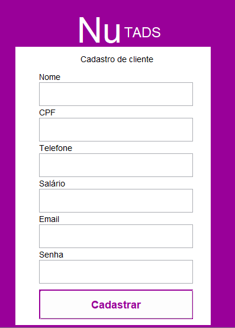
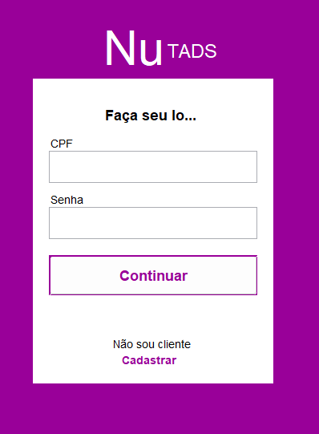
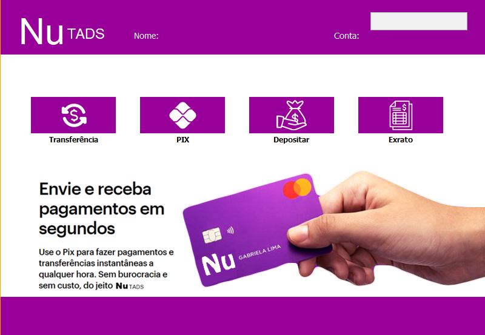
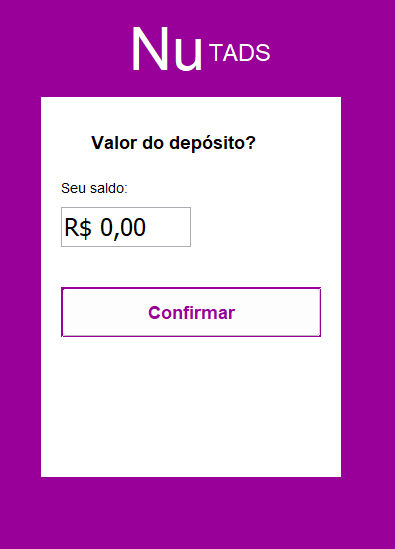
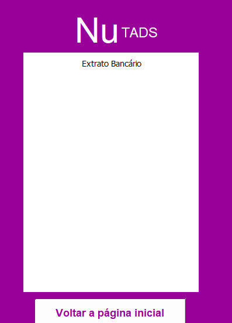

# NuTads

🚀 Esse projeto foi realizado em dupla e tinha objetivo de ser uma réplica do
aplicativo NuBank, mas com uma versão para Desktop. Além disso,
consegue-se realizar a persistência de alguns dados do programa! 🚀

### Pré-requisitos

Antes de começar, você vai precisar ter instalado em sua máquina as seguintes ferramentas:

Além disto é bom ter um editor para trabalhar com o código como [NetBeans](https://netbeans.apache.org/) e o Java (https://www.java.com/pt-BR/download/ie_manual.jsp?locale=pt_BR)

 Realize o download do projeto

1. git clone https://github.com/lucasrp98/NuTads
2. inicialize o projeto no NetBeans

### 🛠 Tecnologias

As seguintes ferramentas foram usadas na construção do projeto:

- [Java](https://www.java.com/pt-BR/download/ie_manual.jsp?locale=pt_BR)

### Status
<h4 align="center"> 
	🚧  Java Select 🚀 Em Andamento...  🚧
</h4>

### Screenshots

Tela de Cadastro 

<h1 align="center">
  
</h1>

Tela de Login 

<h1 align="center">
  
</h1>

Página Inicial 

<h1 align="center">
  
</h1>

Tela do PIX

<h1 align="center">
  
</h1>

Tela do Extrato Bancário

<h1 align="center">
  
</h1>

Tela do TED

<h1 align="center">
  
</h1>

### Autor

Feito de ❤️ por Lucas Ribeiro👋🏽 Entre em contato!

<h1 align="center">
  
</h1>

   

